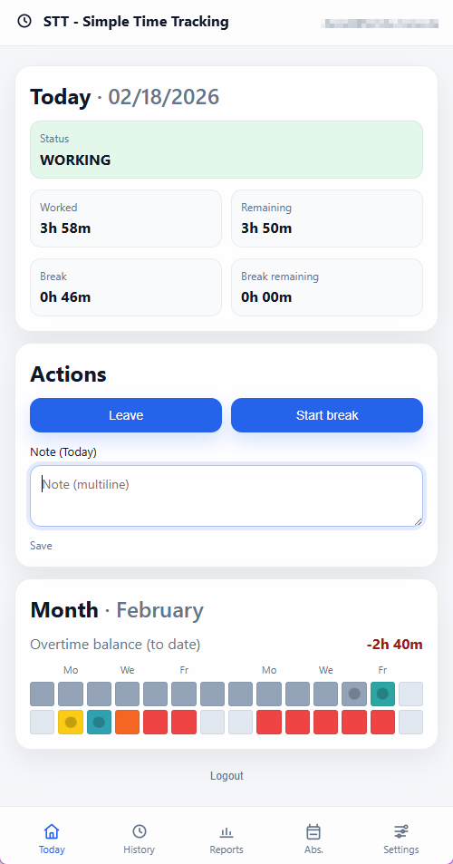

# STT — Simple Time Tracking

STT is a mobile-first time tracking **PWA** (Progressive Web App) for tracking work time and breaks.



It is built as a small, self-hostable stack:

- **Backend**: FastAPI + SQLAlchemy + SQLite (+ Alembic migrations)
- **Frontend**: Vite + React + `vite-plugin-pwa`

## Features

- **Clock events**: COME / GO / BREAK_START / BREAK_END
- **Dashboard**: live status (OFF/WORKING/BREAK), worked/break totals, remaining targets
- **History**: recent entries (default: last 7 days) with edit/delete
- **Reports**: weekly and monthly reports with navigation (jump/prev/next)
- **Absences**: CRUD absences and absence reasons
- **Notes**: day notes visible in the monthly heatmap
- **Multi-language UI**: English + German
- **Offline-friendly**: PWA installable
- **(Optional) Web Push notifications**: per-user thresholds for work/break minutes

## Repo layout

- `backend`: FastAPI backend
- `frontend`: Vite + React frontend

## Requirements

- Python **3.11+** (backend)
- Node.js **18+** (frontend)
- `uv` for Python dependency management

## Run locally

### 1) Backend (API)

```bash
cd backend

# create/update local sqlite db
uv run alembic upgrade head

# start API
uv run uvicorn app.main:app --reload
```

The API will run on `http://localhost:8000`.

#### Backend config

Copy and edit `backend/.env.example` → `backend/.env`.

Important variables:

- `TT_BASE_URL` (frontend origin for CORS, e.g. `http://localhost:5173`)
- `TT_SQLITE_PATH` (SQLite file path, default `./data/app.db`)
- `TT_JWT_SECRET_KEY` (change in production)

### 2) Frontend (Web)

```bash
cd frontend
npm install

# configure API base url
cp .env.example .env

npm run dev
```

The frontend will run on `http://localhost:5173`.

#### Frontend config

`frontend/.env`:

```env
VITE_API_BASE_URL=http://localhost:8000
```

## Push notifications (optional)

STT supports real **Web Push** notifications (delivered even when the PWA is closed) with per-user threshold lists:

- “Work thresholds (minutes)” → e.g. `30, 60, 120`
- “Break thresholds (minutes)” → e.g. `10, 20, 30`

When a threshold is reached, the backend worker sends a push message like:

- “You have worked X minutes so far.”
- “You have taken X minutes break so far.”

### 1) Configure VAPID keys

Generate VAPID keys (example using `py-vapid`):

```bash
cd backend
uv run python -c "from py_vapid import Vapid; v=Vapid(); v.generate_keys(); print(v.public_key); print(v.private_key)"
```

Add them to `backend/.env`:

```env
TT_VAPID_PUBLIC_KEY=...
TT_VAPID_PRIVATE_KEY=...
TT_VAPID_SUBJECT=mailto:admin@example.com
```

### 2) Run the push worker

The push sender runs as a separate process:

```bash
cd backend
uv run python -m app.push_worker
```

### 3) Enable in the UI

Open **Settings → Push notifications** and click **Enable push**.

Note:

- Web Push typically requires **HTTPS** (or `localhost`).
- iOS Safari has limitations; Chrome/Edge on desktop works best for testing.

## More docs

- Backend: `backend/README.md`
- Frontend: `frontend/README.md`

## Run with Docker

### Single Container (Simplest)

For a quick single-container deployment with everything included:

```bash
# Build the image
docker build -t simple-time-tracking .

# Run with required environment variables
docker run -d \
  --name stt \
  -p 5000:5000 \
  -v stt-data:/app/data \
  -e TT_JWT_SECRET_KEY=your-secure-secret-key \
  -e TT_PUBLIC_APP_URL=http://localhost:5000 \
  -e TT_SMTP_HOST=smtp.gmail.com \
  -e TT_SMTP_PORT=587 \
  -e TT_SMTP_FROM=your-email@gmail.com \
  -e TT_SMTP_USER=your-email@gmail.com \
  -e TT_SMTP_PASSWORD=your-app-password \
  -e TT_SMTP_STARTTLS=true \
  simple-time-tracking
```

The app will be available at `http://localhost:5000`.

**Required environment variables:**
- `TT_JWT_SECRET_KEY` - Secret key for JWT token signing (change this!)
- `TT_PUBLIC_APP_URL` - Your app's public URL (used for password reset links)
- `TT_SMTP_HOST`, `TT_SMTP_PORT`, `TT_SMTP_FROM` - SMTP settings for password reset emails

**Optional environment variables:**
- `TT_SMTP_USER`, `TT_SMTP_PASSWORD` - SMTP authentication
- `TT_SMTP_STARTTLS` - Use STARTTLS (default: false)
- `TT_SMTP_USE_TLS` - Use SMTPS (default: false)
- `TT_VAPID_PUBLIC_KEY`, `TT_VAPID_PRIVATE_KEY`, `TT_VAPID_SUBJECT` - For Web Push notifications
- `TT_BASE_URL` - Frontend origin for CORS (default: http://localhost:5000)
- `TT_SQLITE_PATH` - Database path (default: /app/data/app.db)

### Docker Compose (Multi-Container)

This repository also includes a `docker-compose.yml` that starts:

- `web` (nginx serving the built PWA)
- `api` (FastAPI backend)
- `push-worker` (**optional**, sends Web Push notifications)

### 1) Configure environment variables

Copy the example file and adjust values as needed:

```bash
cp .env.docker.example .env
```

Notes:

- All backend settings that are normally read from `backend/.env` can be supplied via **Docker environment variables**.
- SQLite is stored in a named Docker volume (`stt-data`).

### 2) Start

```bash
docker compose up --build
```

Then open:

- Web UI: http://localhost:5173
- API: http://localhost:8000

### 3) Push notifications

To enable Web Push, set the VAPID variables in `.env` (docker compose env file):

```env
TT_VAPID_PUBLIC_KEY=...
TT_VAPID_PRIVATE_KEY=...
TT_VAPID_SUBJECT=mailto:admin@example.com
```

Then start the optional worker profile:

```bash
docker compose --profile push up --build
```

The `push-worker` service uses the same env vars and the same SQLite database volume.

## Password reset (email)

STT includes an email-based password reset flow:

- Login page → “Forgot password?”
- Request reset link via email
- Open link and set a new password

Backend configuration (environment variables):

- `TT_PUBLIC_APP_URL` (required): Base URL of the web app, used to build the reset link
- `TT_SMTP_HOST` / `TT_SMTP_PORT` / `TT_SMTP_FROM` (required)
- `TT_SMTP_USER` / `TT_SMTP_PASSWORD` (optional auth)
- `TT_SMTP_STARTTLS` (optional, default false)
- `TT_SMTP_USE_TLS` (optional SMTPS, default false)

Notes:

- Default is **plain SMTP** (no TLS). Enable STARTTLS/SMTPS via flags if needed.
- If `TT_SMTP_USER` is set, `TT_SMTP_PASSWORD` must also be set.
